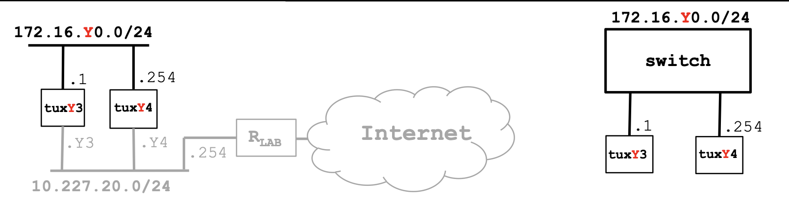

# Exp 1- Configure an IP Network

1. Connect E1 of tuxY3 and E1 of tuxY4 to the switch
2. Configure if_e1 interface of tuxY3 and if_e1 interface of tuxY4 using ifconfig
3. Write down the IP and MAC addresses of the network interfaces
4. Use ping command to verify connectivity between these computers
5. Inspect forwarding (route -n) and ARP (arp -a) tables
6. Delete ARP table entries in tuxY3 (arp -d ipaddress)
7. Start Wireshark in tuxY3.if_e1 and start capturing packets
8. In tuxY3, ping tuxY4 for a few seconds
9. Stop capturing packets
10. Save the log and study it at home

# Solution (Table 11)
> Run `sudo ifconfig if_e1` `172.16.Y0.V/24`
>
> Where `Y = table number (11)`
>
> And `V = Tux` `1 for tux3 and 254 for tux4`

## Tux 3
tux3 $ `sudo ifconfig if_e1 172.16.110.1/24`

> IP: `172.16.110.1/24`
> 
> MAC: `ec:75:0c:c2:3c:7b`
## Tux 4
tux4 $ `sudo ifconfig if_e1 172.16.110.254/24`

> IP: `172.16.110.254/24`
> 
> MAC: `ec:75:0c:c2:3c:96`

# Questions:

### What are the ARP packets and what are they used for?
### What are the MAC and IP addresses of ARP packets and why?
### What packets does the ping command generate?
### What are the MAC and IP addresses of the ping packets?
### How to determine if a receiving Ethernet frame is ARP, IP, ICMP?
### How to determine the length of a receiving frame?
### What is the loopback interface and why is it important?