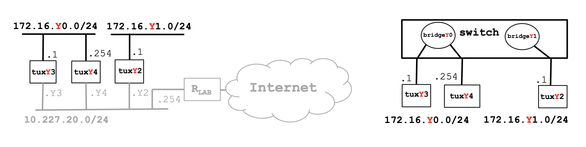

# Exp 2 - Implement two bridges in a switch

# Steps
1. Connect and configure E1 of tuxY2 and write down its IP and MAC addresses
2. Create two bridges in the switch: bridgeY0 and bridgeY1
3. Remove the ports where tuxY3, tuxY4 and tuxY2 are connected from the default bridge (bridge) and add them the corresponding ports to bridgeY0 and bridgeY1
4. Start the capture at tuxY3.if_e1
5. In tuxY3, ping tuxY4 and then ping tuxY2
6. Stop the capture and save the log
7. Start new captures in tuxY2.if_e1, tuxY3.if_e1, tuxY4.if_e1
8. In tuxY3, do ping broadcast (ping -b 172.16.Y0.255) for a few seconds
9. Observe the results, stop the captures and save the logs
10. Repeat steps 7, 8 and 9, but now do
    - ping broadcast in tuxY2 (ping -b 172.16.Y1.255)

# Solution (Table 11)
> ### Useful commands (on MikroTik terminal):
> View current bridges: `/interface bridge print`
>
> View bridge (specific): `/interface bridge print where bridge=bridgeName`
>
> Create a new bridge: `/interface bridge add name=bridgeName` - Where bridgeName is in the form bridgeY0 / bridgeY1, with Y = table number.
>
> Remove a port from a bridge: `/inteface bridge port remove [find interface=etherN]` - Where N is the physical port where each tux is connected.
>
> Add a port to a bridge: `/interface bridge print where bridge=bridgeName`

## Switch
> Conect tux2 e1 to `ether8`
>
> Conect tux3 e1 to `ether9`
>
> Conect tux4 e1 to `ether10`
## Tux2:
tux2 $ `sudo ifconfig if_e1 172.16.111.1/24`
> IP: `172.16.111.1/24`
> 
> MAC: `ec:75:0c:c2:17:51`
## Tux 3
tux3 $ `sudo ifconfig if_e1 172.16.110.1/24`

## Tux 4
tux4 $ `sudo ifconfig if_e1 172.16.110.254/24`

## Tux2 (MikroTik terminal):
> ### Add the bridges
> MikroTik $ `/interface bridge add name=bridge110`
> 
> MikroTik $ `/interface bridge add name=bridge111`
>
> ### Remove all the ports from the default bridges
> MikroTik $ `/interface bridge port remove [find interface=ether8]`
>
> MikroTik $ `/interface bridge port remove [find interface=ether9]`
> 
> MikroTik $ `/interface bridge port remove [find interface=ether10]`
>
> ### Add tux2 and tux3 to bridge110
> MikroTik $ `/interface bridge add bridge=bridge110 interface=ether9`
>
> MikroTik $ `/interface bridge add bridge=bridge110 interface=ether10`
> ### Add tux4 to bridge111
> MikroTik $ `/interface bridge add bridge=bridge111 interface=ether8`

# Questions
### How to configure bridgeY0?

### How many broadcast domains are there? How can you conclude it from the logs?
