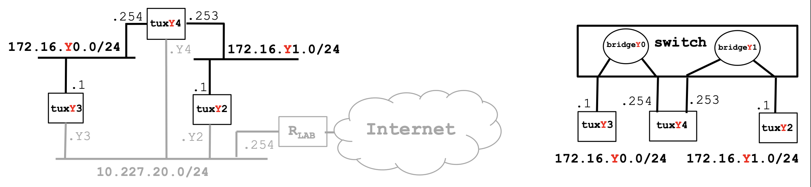

# Exp 3 - Configure a Router in Linux

# Steps
1. Transform tuxY4 (Linux) into a router
    - Configure also if_e2 interface of tuxY4 and add it to bridgeY1 on E2
    - Enable IP forwarding
    - Disable ICMP echo-ignore-broadcast
2. Observe MAC addresses and IP addresses in tuxY4.if_e1 and tuxY4.if_e2
3. Reconfigure tuxY3 and tuxY2 so that each of them can reach the other
4. Observe the routes available at the 3 tuxes (route -n)
5. Start capture at tuxY3
6. From tuxY3, ping the other network interfaces (172.16.Y0.254, 172.16.Y1.253,
172.16.Y1.1) and verify if there is connectivity
7. Stop the capture and save the logs
8. Start capture in tuxY4; use 2 instances of Wireshark, one per network interface
9. Clean the ARP tables in the 3 tuxes
10. In tuxY3, ping tuxY2 for a few seconds.
11. Stop captures in tuxY4 and save logs

# Solution (Table 10)
## Switch
> Conect tux2 e1 to `ether8`
>
> Conect tux3 e1 to `ether9`
>
> Conect tux4 e1 to `ether10`
>
> Connect tux4 e2 to `ether11`

## Tux2
tux2 $ `sudo ifconfig if_e1 172.16.101.1/24`
> IP: `172.16.101.1/24`
> 
> MAC: `ec:75:0c:c2:17:8b`
## Tux3
tux3 $ `sudo ifconfig if_e1 172.16.100.1/24`
> IP: `172.16.100.1`
> 
> MAC: `ec:75:0c:c2:3c:f5`
## Tux4
tux4 $ `sudo ifconfig if_e1 172.16.100.254/24`
> IP e1: `172.16.100.254`
>
> MAC e1: `ec:75:0c:c2:51:4d`

tux4 $ `sudo ifconfig if_e2 172.16.101.253/24`
> IP e2: `172.16.101.253`
> 
> MAC e2: `ec:75:0c:c2:17:2a`

Enable IP Forwarding
tux 4 $ `sudo sysctl net.ipv4.ip_forward=1`

Disable ICMP echo-ignore-broadcasts
tux 4 $ `sudo sysctl net.ipv4.icmp_echo_ignore_broadcasts=0`

## Tux3
Add routes to Tux2
tux3 $ `sudo route add -net 172.16.101.1/24 gw 172.16.100.254`

## Tux2
Add routes to Tux2
tux2 $ `sudo route add -net 172.16.100.1/24 gw 172.16.101.253`