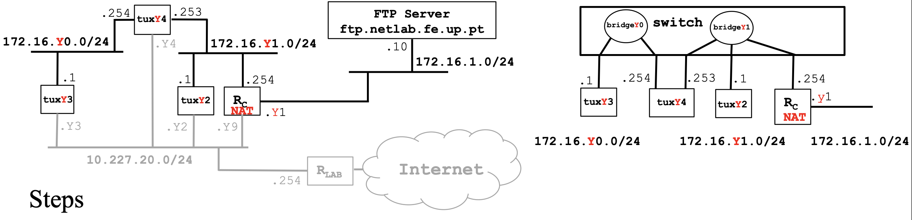

# Exp 4 - Configure a Commercial Router and Implement NAT

# Steps 
1. Connect ether1 of RC to the lab network on PY.12 (with NAT enabled by
default) and ether2 of RC to a port on bridgeY1. Configure the IP addresses of
RC through the router serial console
2. Verify routes and add if necessary:
    - in tuxY3 routes for 172.16.Y1.0/24 and 172.16.1.0/24
    - in tuxY4 route for 172.16.1.0/24
    - in tuxY2 routes for 172.16.Y0.0/24 and 172.16.1.0/24
3. in RC add route for 172.16.Y0.0/24
Using ping commands and Wireshark, verify if tuxY3 can ping all the network
interfaces of tuxY2, tuxY4 and RC
4. In tuxY2
    - Do the following:
        - sysctl net.ipv4.conf.if_e1.accept_redirects=0
        - sysctl net.ipv4.conf.all.accept_redirects=0
    - In tuxY2, change the routes to use RC as the gateway to subnet 172.16.Y0.0/24
    instead of tuxY4
    - In tuxY2, ping tuxY3
    - Using capture at tuxY2, try to understand the path followed by ICMP ECHO and
    ECHO-REPLY packets (look at MAC addresses)
    - In tuxY2, do traceroute tuxY3
    - In tuxY2, change the routes to use again tuxY4 as the gateway to subnet
    172.16.Y0.0/24 instead of RC. Do traceroute tuxY3
    - Activate the acceptance of ICMP redirect at tuxY2 when there is no route to
    172.16.Y0.0/24 via tuxY4 and try to understand what happens
5. In tuxY3, ping the FTP server (172.16.1.10) and try to understand what happens
6. Disable NAT functionality in router RC
7. In tuxY3 ping 172.16.1.10, verify if there is connectivity, and try to understand
what happens

# Solution (Table 11)
## Connections and configurations
### Switch
> Conect tux2 e1 to `ether8`
>
> Conect tux3 e1 to `ether9`
>
> Conect tux4 e1 to `ether10`
>
> Connect tux4 e2 to `ether11`
>
> Connect ether1 of RC to `PY.12`
>
> Connect ether2 of RC to `ether12`

### Tux2
tux2 $ `sudo ifconfig if_e1 172.16.111.1/24`
> IP: `172.16.111.1/24`
> 
> MAC: `ec:75:0c:c2:17:51`
### Tux3
tux3 $ `sudo ifconfig if_e1 172.16.110.1/24`
> IP: `172.16.110.1`
> 
> MAC: `ec:75:0c:c2:3c:7b`
### Tux4
tux4 $ `sudo ifconfig if_e1 172.16.110.254/24`
> IP e1: `172.16.110.254`
>
> MAC e1: `ec:75:0c:c2:3c:96`

tux4 $ `sudo ifconfig if_e2 172.16.111.253/24`
> IP e2: `172.16.111.253`
> 
> MAC e2: `ec:75:0c:c2:2d:dc`

Enable IP Forwarding
> tux 4 $ `sudo sysctl net.ipv4.ip_forward=1`

Disable ICMP echo-ignore-broadcasts
> tux 4 $ `sudo sysctl net.ipv4.icmp_echo_ignore_broadcasts=0`

### Switch Console
> MikroTik $ `/interface bridge port remove [find interface=ether12]`
>
> MikroTik $ `/interface bridge port add bridge=bridge111 interface=ether12`

### Router Console
> MikroTik $ `/ip address add address=172.16.1.110/24 interface=ether1`
>
> MikroTik $ `/ip address add address=172.16.111.254/24 interface=ether2` 

## Routing
### Tux 3
Add routes to bridge 2
> tux3 $ `sudo route add -net 172.16.111.0/24 gw 172.16.110.254`

And to the Router
> tux3 $ `sudo route add -net 172.16.1.0/24 gw 172.16.110.254`

### Tux 4
Add routes to the Internet via Router
> tux 4 $ `sudo route add -net 172.16.1.0/24 gw 172.16.111.254`

### Tux 2
Add routes to tux3
> tux2 $ `sudo route add -net 172.16.110.0/24 gw 172.16.110.253`

Add routes to the Internet via Router
> tux2 $ `sudo route add -net 172.16.1.0/24 gw 172.16.111.254`

### Router
Add routes to tux3
> MikroTik $ `/ip route add dst-address=172.16.110.0/24 gateway=172.16.111.253`

### Checking routes
#### Tux 3
> Ping tux2
> tux3 $ `sudo ping 172.16.111.254`
>
> Ping tux4 
> tux3 $ `sudo ping 172.16.110.254`
> 
> tux3 $ `sudo ping 172.16.111.253`
>
> Ping the Router
> tux3 $ `sudo ping 172.16.111.254`
>
> Ping the Internet
> tux3 $ `sudo ping 172.16.1.111`
>
> All should have connection

## Redirect Host
### Tux 2
> tux2 $ `sudo sysctl net.ipv4.conf.if_e1.accept_redirects=0`
>
> tux2 $ `sysctl net.ipv4.conf.all.accept_redirects=0`
>
> Disable the route from Tux2 to Tux3 gateway Tux4
> tux2 $ `sudo route del -net 172.16.110.0/24 gw 172.16.111.253`
>
> Add the route from Tux2 to Tux3 gateway RC
> tux2 $ `sudo route add -net 172.16.110.0/24 gw 172.16.111.254`
>
> Ping Tux3 from Tux2 (should receive a lot of Redirect Host messages)
> tux2 $ `sudo ping 172.16.110.1`

