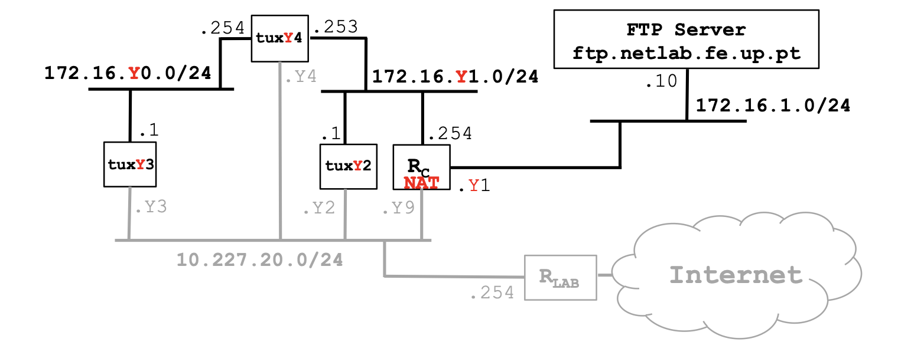
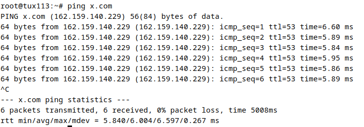
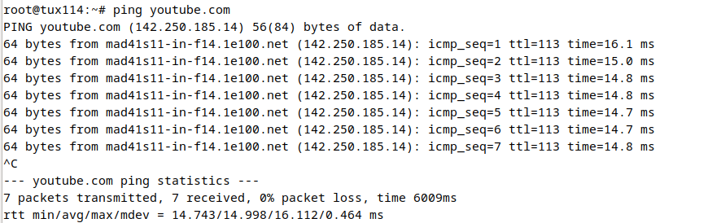

# Exp 5 - DNS

# Steps
1. Configure DNS at tuxY3, tuxY4, tuxY2
(use DNS server services.netlab.fe.up.pt (10.227.20.3))
2. Verify if names can be used in these hosts (e.g., ping hostname, use browser)
3. Execute ping (new-hostname-in-the-Internet); observe DNS related packets in
Wireshark

# Solution (Table 11)
## Do the same configuration of Experience 4 until step `Redirect Host`

## Connecting DNS
### Tux2, Tux3 and Tux4
> tux2 $ `sudo nano /etc/resolv.conf`
>
> write `services.netlab.fe.up.pt 10.227.20.3`

### Try to ping a website in any Tux
> tux $ `ping youtube.com`
>
> Verify that connection is successful
>
> 
>
> 
>
> 