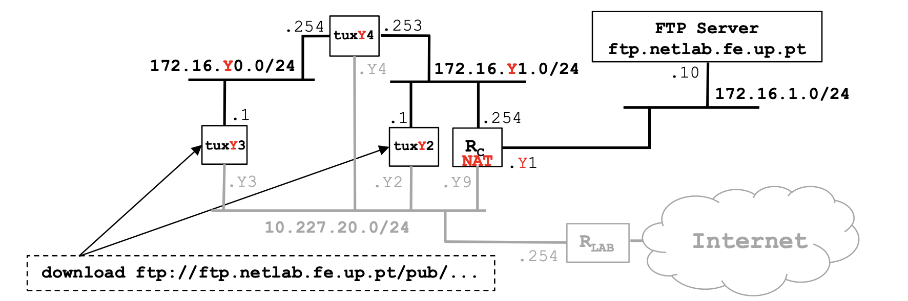

# Exp 6 - TCP connections

# Steps
1. Compile your download application in tuxY3
2. In tuxY3, restart capturing with Wireshark and run your application
3. Verify if file has arrived correctly, stop capturing and save the log
4. Using Wireshark, observe packets exchanged including:
    - TCP control and data connections, and its phases (establishment, data,
    termination)
    - Data transferred through the FTP control connection
    - TCP ARQ mechanism
    - TCP congestion control mechanism in action
    - Note: use also the Wireshark Statistics tools (menu) to study the TCP
phases, ARQ and congestion control mechanism
5. Repeat the download in tuxY3 but now, in the middle of the transfer, start a new download in tuxY2
    - Use the Wireshark statistics tools to understand how the throughput of a
    TCP connection varies along the time 

# Complete configuration (Table 11)
## Resetting the configurations
### Router and Switch Console
> MikroTik $ `/system reset-configuration`

### On each PC
> sudo service networking restart

## Physical Connections
> Conect tux2 e1 to `ether8`
>
> Conect tux3 e1 to `ether9`
>
> Conect tux4 e1 to `ether10`
>
> Connect tux4 e2 to `ether11`
>
> Connect ether1 of RC to `PY.12`
>
> Connect ether2 of RC to `ether12`

## IP Connections
### Tux2
tux2 $ `sudo ifconfig if_e1 172.16.111.1/24`
> IP: `172.16.111.1/24`
> 
> MAC: `ec:75:0c:c2:17:51`

### Tux3
tux3 $ `sudo ifconfig if_e1 172.16.110.1/24`
> IP: `172.16.110.1`
> 
> MAC: `ec:75:0c:c2:3c:7b`

### Tux4
tux4 $ `sudo ifconfig if_e1 172.16.110.254/24`
> IP e1: `172.16.110.254`
>
> MAC e1: `ec:75:0c:c2:3c:96`

tux4 $ `sudo ifconfig if_e2 172.16.111.253/24`
> IP e2: `172.16.111.253`
> 
> MAC e2: `ec:75:0c:c2:2d:dc`

Enable IP Forwarding
> tux 4 $ `sudo sysctl net.ipv4.ip_forward=1`

Disable ICMP echo-ignore-broadcasts
> tux 4 $ `sudo sysctl net.ipv4.icmp_echo_ignore_broadcasts=0`

### Router Console
> MikroTik $ `/ip address add address=172.16.1.110/24 interface=ether1`
>
> MikroTik $ `/ip address add address=172.16.111.254/24 interface=ether2` 

## Bridging
### Switch Console

> ### Add the bridges
> MikroTik $ `/interface bridge add name=bridge110`
> 
> MikroTik $ `/interface bridge add name=bridge111`
>
> ### Remove all the ports from the default bridges
> MikroTik $ `/interface bridge port remove [find interface=ether8]`
>
> MikroTik $ `/interface bridge port remove [find interface=ether9]`
> 
> MikroTik $ `/interface bridge port remove [find interface=ether10]`
> 
> MikroTik $ `/interface bridge port remove [find interface=ether11]`
> 
> MikroTik $ `/interface bridge port remove [find interface=ether12]`
>
>
> ### Add tux3 and tux4 (e1) to bridge110
> MikroTik $ `/interface bridge port add bridge=bridge110 interface=ether9`
>
> MikroTik $ `/interface bridge port add bridge=bridge110 interface=ether10`
> ### Add tux2, tux4 (e2) and RC to bridge111
> MikroTik $ `/interface bridge port add bridge=bridge111 interface=ether8`
>
> MikroTik $ `/interface bridge port add bridge=bridge111 interface=ether11`
>
> MikroTik $ `/interface bridge port add bridge=bridge111 interface=ether12`

## Routing
### Tux 3
Add routes to bridge 2
> tux3 $ `sudo route add -net 172.16.111.0/24 gw 172.16.110.254`

And to the Internet via Router
> tux3 $ `sudo route add -net 172.16.1.0/24 gw 172.16.110.254`

### Tux 4
Add routes to the Internet via Router
> tux 4 $ `sudo route add -net 172.16.1.0/24 gw 172.16.111.254`

### Tux 2
Add routes to tux3
> tux2 $ `sudo route add -net 172.16.110.0/24 gw 172.16.110.253`

Add routes to the Internet via Router
> tux2 $ `sudo route add -net 172.16.1.0/24 gw 172.16.111.254`

### Router
Add routes to tux3
> MikroTik $ `/ip route add dst-address=172.16.110.0/24 gateway=172.16.111.253`

### Checking routes
#### Tux 3
> Ping tux2
> tux3 $ `sudo ping 172.16.111.254`
>
> Ping tux4 
> tux3 $ `sudo ping 172.16.110.254`
> 
> tux3 $ `sudo ping 172.16.111.253`
>
> Ping the Router
> tux3 $ `sudo ping 172.16.111.254`
>
> Ping the Internet
> tux3 $ `sudo ping 172.16.1.111`
>
> All should have connection

- How to configure a static route in a commercial router?
- What are the paths followed by the packets, with and without ICMP redirect
enabled, in the experiments carried out and why?
- How to configure NAT in a commercial router?
- What does NAT do?
- What happens when tuxY3 pings the FTP server with the NAT disabled? Why?

